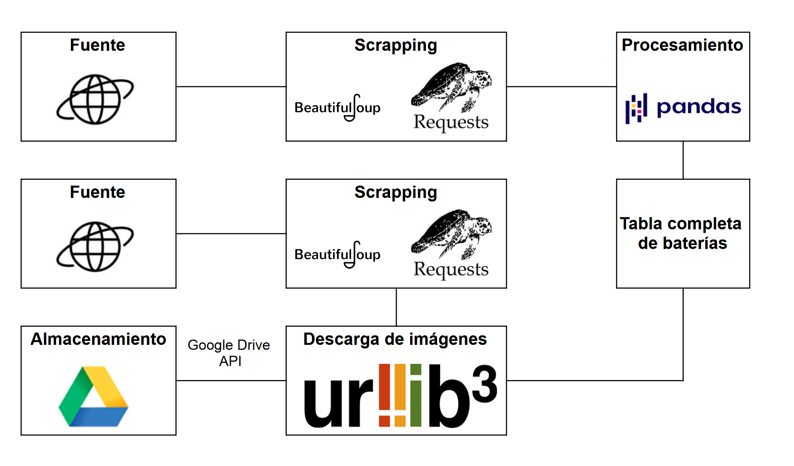

# Webscrapping - Imágenes
En el siguiente proyecto se realizó el scrapping de un conjunto de imágenes de una página web utilizando el módulo de Python BeautifuSoup.

## **Objetivos**
Los objetivos planteados eran los siguientes:
* Almacenar localmente las imágenes obtenidas desde una web de un fabricante de baterías. Fuente: https://www.exidegroup.com/es/es/battery-finder/browse-all
* Renombrar las imágenes dándoles el siguiente formato Marca- MODELO.jpg. Ejemplo: EXIDE- EK508.jpg.
* Subir las mismas a Google Drive utilizando Google Drive API.
* Crear un archivo de Excel con el nombre de cada imagen dado anteriormente juntamente con su URL.

## **Proceso y stack tecnológico**
Para realizar el trabajo se utilizaron las siguientes herramientas:

